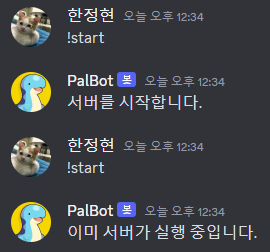
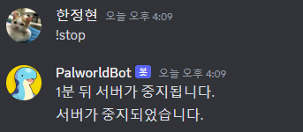
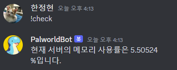
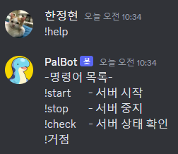
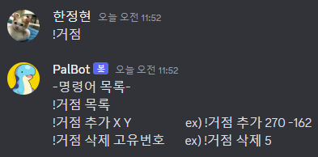
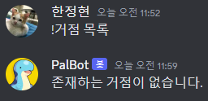
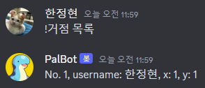
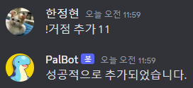
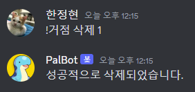

# Palworld Discord Bot

Discord.js를 이용한 팰월드 서버 관리 디스코드 봇<br>
팰월드 게임 엔진 메모리 누수 문제 대응 서버 관리 및 편의성 기능 제공

## 개발환경

-   Ubuntu 22.04.3 LTS
-   node.js v18.16.0
-   mysql 8.0.36
-   [팰월드 서버 구축](https://www.youtube.com/watch?v=SZaopYC6paY) 해당 영상에 기반한 리눅스 환경
-   디스코드 계정 및 서버 관리 권한

## Features and Commands

-   21시 04분 서버 중지 알림
-   21시 05분 서버 중지
-   21시 06분 서버 시작 및 알림
-   10분 단위 서버 메모리 체크 및 90% 이상 사용시 서버 중지

|     커맨드     |          기능           |                                               예시                                               |
| :------------: | :---------------------: | :----------------------------------------------------------------------------------------------: |
|     !start     |        서버 가동        |                                                        |
|     !stop      |        서버 중지        |                                                         |
|     !check     | 서버 메모리 사용률 확인 |                                                        |
|     !help      |       커맨드 목록       |                                                         |
|     !거점      |    거점 커맨드 목록     |                                                         |
|   !거점 목록   |    등록된 거점 확인     | <br> |
| !거점 추가 X Y |        거점 추가        |                                                     |
|  !거점 삭제 N  |    등록된 거점 삭제     |                                                     |

## Guide

-   https://kante-kante.tistory.com/34 토큰 생성 -> .env파일 DISCORD_TOKEN에 입력 <br> URL 생성 시 SCOPES = BOT, PERMISSIONS = Read Messages/View Channels Send Messages에 체크
-   디스코드 채널의 채널 ID를 .env파일 CHANNEL_ID에 입력
-   scripts/start.sh - 구글 아이디 -> 본인의 구글 아이디로

-   nvm 설치

```
curl -o- https://raw.githubusercontent.com/nvm-sh/nvm/v0.35.3/install.sh | bash
```

-   node 설치

```
nvm install 18.16.0
```

-   mysql 설치

```
sudo apt install mysql-server
```

-   mysql 로그인

```
sudo mysql -u root
```

-   데이터베이스 생성

```
CREATE DATABASE palworldDB;
```

-   계정 생성 - 계정이름과 비밀번호를 .env 파일의 DB_USER와 DB_PASSWORD에 각각 입력

```
CREATE USER '계정이름'@'localhost' IDENTIFIED BY '비밀번호';
```

-   접근 권한 부여

```
GRANT ALL PRIVILEGES ON *.* TO '계정이름'@'localhost';
FLUSH PRIVILEGES;
```

-   테이블 생성

```
CREATE TABLE pal_user (num integer auto_increment primary key, username varchar(20) not null, x integer not null, y integer not null);
```

-   mysql 로그아웃

```
exit
```

-   레포지토리 클론 (MobaXterm 파일 업로드로 대체 가능)

```
git clone https://github.com/p1432pop/Palworld-Discord-Bot.git
```

-   디렉토리 이동 및 의존성 설치

```
cd Palworld-Discord-Bot
npm install
```

-   파일 실행 권한 부여

```
cd scripts
chmod 755 start.sh stop.sh is_running.sh check.sh
cd ..
```

-   봇 실행

```
pm2 start index.js
```
